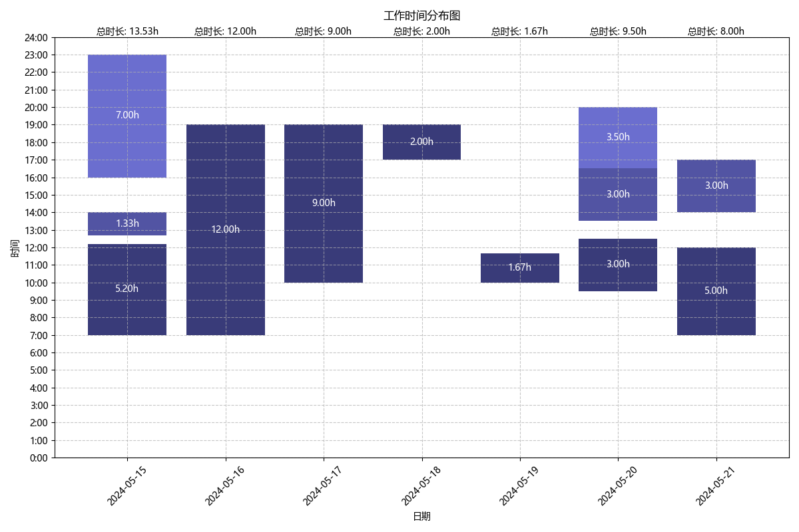

# Super-Long-Countdown
This is a widget that provides a countdown for as long as you want.

这是一个可以提供超长倒计时的小程序，采用Tkinter作为GUI

该小程序具有基本计时器，开始计时，暂停计时，重置计时的功能，不同的是，该计时器可以自定义任何时长，甚至设置为0（用于正计时，或显示超时时间）

倒计时进度可以保存，下次打开还可以继续计时

#### 打包指南

```shell
pyinstaller -F -w clock.py
```
```shell
pyinstaller -F -w clock.py -i favicon.ico
```

#### 运行指南
安装依赖
```shell
pip install -r requirements.txt
```

运行计时器
```shell
python clock.py
```

生成工作时常分布图
```shell
python data_analyzer/plot_pro.py
```
预览效果
<div>
    
</div> 


#### 当前功能更新：

- 未暂停直接关闭也可以自动保存计时进度
- 新增自定义计时时间功能
- 新增计时器重置功能，可以在暂停计时的时候重置计时器
- 配色，透明度，窗口置顶可以通过配置文件修改
- 通过脚本（详见运行指南）可以分析计时器记录的时间段，并生成可视化的工作时间分布图
- 计时器可以显示当前工作段时长

#### 当前bug修复&版本进度：

- ###### Version 1.0.0
- 修复了按钮可以重复点击导致计时故障的问题
- 修复了重置窗口处于主窗口下方的问题
- 修复超时时间显示不正确的问题
- ###### Version 1.0.1
- 修复了应用内图标不清晰的问题
- 更改配色，优化UI
- ###### Version 1.0.2
- 更改配色，优化UI，窗口默认置顶
- 配色，窗口置顶可以通过配置文件修改
- 修复了关机无法触发自动保存，损失大量进度的问题（每10秒自动更新存储）
- 修复了暂停后关闭会触发两次保存的问题
- ###### Version 1.0.3
- 新增单次计时功能
- 超出时间不再以 "-" 表示，改为以 "+" 表示
- 时间格式化为 "00:00:00"
